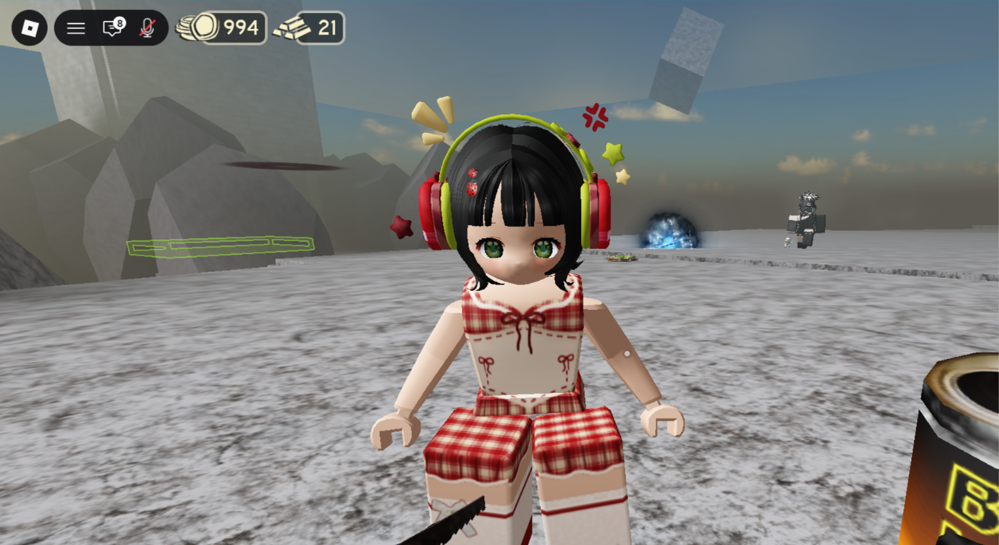
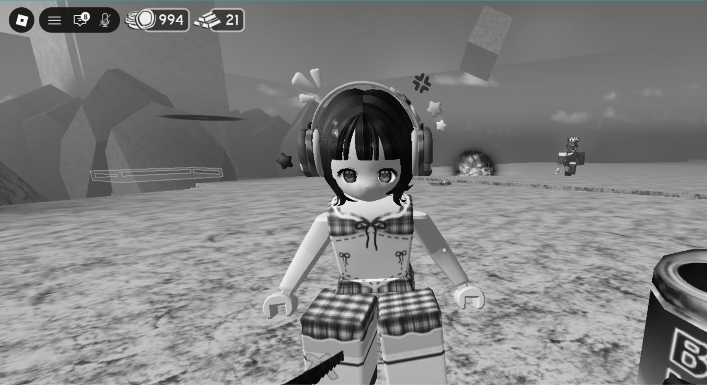
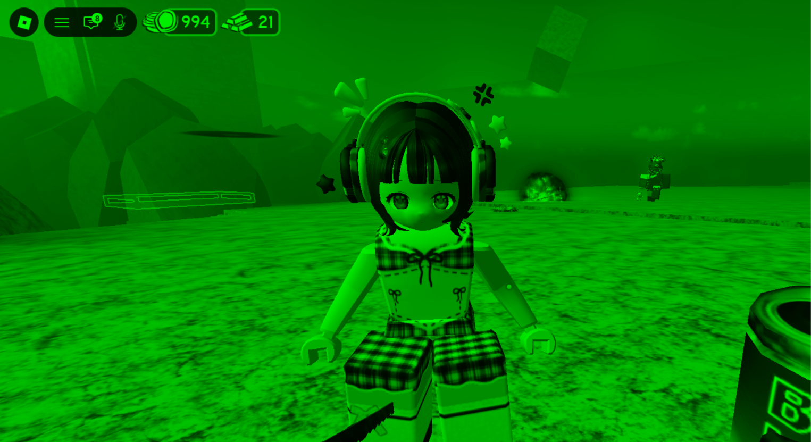
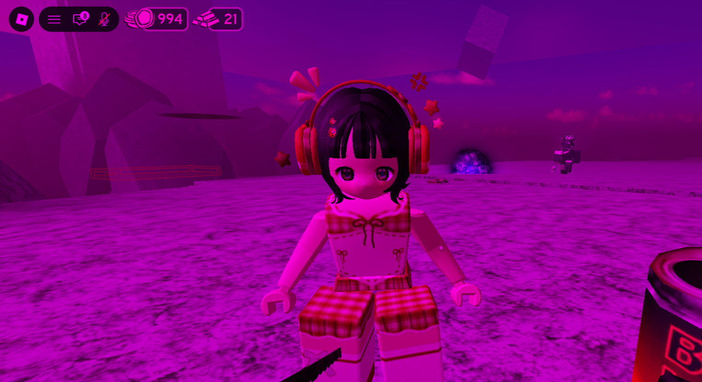
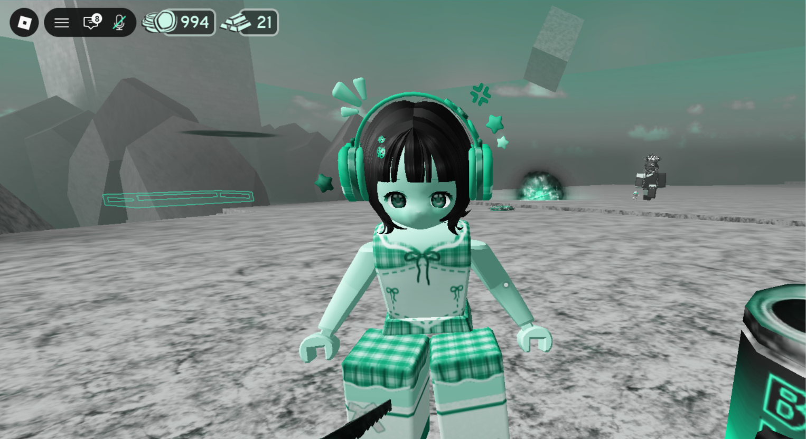
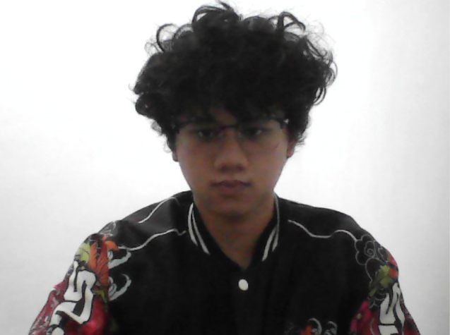

# Tugas 1 PCV

Tugas ini mencakup beberapa proses, yaitu:

- Read Image
- Show Image
- Filter Color Image
- Perubahan Warna Menggunakan HSV (tambahan)
- Filter Color Video menggunakan Webcam

---

## 1. Read Image

Pada bagian ini, program membaca gambar menggunakan fungsi `cv2.imread()`.

Gambar yang digunakan adalah `rb.png`.

---

## 2. Show Image

Setelah gambar berhasil dibaca, program menampilkan gambar asli menggunakan `cv2.imshow()`.

---

## 3. Filter Color Image

Pada bagian ini dilakukan beberapa pengolahan warna pada gambar, yaitu:

- Grayscale
- Filter Green
- Filter Pink

OpenCV menggunakan format warna **BGR**, yaitu:

- Channel 0 = Blue
- Channel 1 = Green
- Channel 2 = Red

Pada filter Green, channel Blue dan Red dihilangkan sehingga warna Green menjadi lebih dominan.

Sedangkan pada filter Pink, channel Green dihilangkan sehingga kombinasi channel Red dan Blue menghasilkan warna yang cenderung pink atau magenta.

---

## 4. Perubahan Warna Menggunakan HSV

Program juga memiliki fitur tambahan untuk mengubah warna gambar secara dinamis menggunakan ruang warna **HSV**.

HSV terdiri dari:

- **H (Hue)** → menentukan jenis warna
- **S (Saturation)** → menentukan tingkat kejenuhan warna
- **V (Value)** → menentukan tingkat kecerahan

Nilai Hue diubah secara terus-menerus dari `0` sampai `179`, kemudian kembali ke `0`. Hal ini menyebabkan warna gambar berubah secara dinamis dan menghasilkan efek colorful/rainbow.

---

## 5. Filter Color Video

Pada bagian ini dilakukan filter warna pada **video secara real-time menggunakan webcam laptop**.

Setiap frame yang diperoleh dari webcam diproses menggunakan filter warna hijau.

Channel Blue dan Red dikurangi menjadi 30% dari nilai aslinya, sedangkan channel Green dipertahankan. Dengan demikian, hasil video menjadi lebih dominan berwarna hijau tanpa membuat seluruh piksel menjadi satu warna hijau yang sama.

---

## 6. Source Code

Berikut adalah source code lengkap `1-Intro.py` yang digunakan pada project ini.

```python
import cv2
import numpy as np


# READ IMAGE

image = cv2.imread("rb.png")

if image is None:
    print("Gambar tidak ditemukan!")
    exit()


# FILTER COLOR IMAGE

# Grayscale
gray = cv2.cvtColor(image, cv2.COLOR_BGR2GRAY)


# Filter Green
green = image.copy()

green[:, :, 0] = 0
green[:, :, 2] = 0


# Filter Pink
pink = image.copy()

pink[:, :, 1] = 0


# SHOW IMAGE

cv2.imshow("Gambar Asli", image)
cv2.imshow("Grayscale", gray)
cv2.imshow("Green", green)
cv2.imshow("Pink", pink)


# PERUBAHAN WARNA MENGGUNAKAN HSV

hue = 0

while True:

    hsv = cv2.cvtColor(image, cv2.COLOR_BGR2HSV)

    hsv[:, :, 0] = hue

    colorful = cv2.cvtColor(hsv, cv2.COLOR_HSV2BGR)

    cv2.imshow("Colorful", colorful)

    hue += 1

    if hue >= 180:
        hue = 0

    if cv2.waitKey(30) == 27:
        break


cv2.destroyAllWindows()


# FILTER COLOR VIDEO - WEBCAM

cap = cv2.VideoCapture(0)

while True:

    ret, frame = cap.read()

    if not ret:
        print("Kamera tidak terbaca")
        break

    green = frame.copy()

    # Mengurangi channel Blue
    green[:, :, 0] = green[:, :, 0] * 0.3

    # Mempertahankan channel Green
    green[:, :, 1] = np.minimum(
        green[:, :, 1] * 1,
        255
    )

    # Mengurangi channel Red
    green[:, :, 2] = green[:, :, 2] * 0.3

    cv2.imshow("Kamera Asli", frame)
    cv2.imshow("Filter Hijau", green)

    # Tekan Q untuk keluar
    if cv2.waitKey(1) & 0xFF == ord('q'):
        break

```
---
## 7. Hasil Filter Color Image

### Gambar Asli



Gambar asli merupakan hasil pembacaan file `rb.png` menggunakan fungsi `cv2.imread()`. Pada tahap ini, gambar belum mengalami perubahan warna sehingga warna yang ditampilkan masih sesuai dengan gambar aslinya.

### Grayscale



Hasil gambar menjadi grayscale karena gambar dikonversi dari BGR menjadi grayscale menggunakan kode `gray = cv2.cvtColor(image, cv2.COLOR_BGR2GRAY)`. Kode tersebut mengubah gambar yang awalnya memiliki tiga channel warna, yaitu Blue, Green, dan Red, menjadi satu channel tingkat keabuan. Oleh karena itu, warna pada gambar tidak lagi ditampilkan sebagai warna asli, tetapi menjadi berbagai tingkat abu-abu dari hitam hingga putih.

### Filter Green



Hasil gambar menjadi dominan berwarna hijau karena channel Blue dan Red dihilangkan menggunakan kode `green = image.copy()`, `green[:, :, 0] = 0`, dan `green[:, :, 2] = 0`. OpenCV menggunakan urutan channel BGR, yaitu channel `0` adalah Blue, channel `1` adalah Green, dan channel `2` adalah Red. Pada kode tersebut, channel Blue dan Red dibuat menjadi `0`, sedangkan channel Green tetap dipertahankan. Karena channel Green tetap memiliki nilai sedangkan channel Blue dan Red dihilangkan, maka hasil gambar menjadi lebih dominan berwarna hijau.

### Filter Pink



Hasil gambar menjadi dominan berwarna pink atau magenta karena channel Green dihilangkan menggunakan kode `pink = image.copy()` dan `pink[:, :, 1] = 0`. Pada OpenCV, channel Green berada pada indeks `1`, sehingga seluruh nilai pada channel tersebut dibuat menjadi `0`. Sementara itu, channel Blue dan Red tetap dipertahankan. Kombinasi warna Blue dan Red menghasilkan warna yang cenderung pink atau magenta, sehingga gambar terlihat seperti hasil filter pada gambar di atas.

---

## 8. Hasil Perubahan Warna Menggunakan HSV

### Colorful Image



Hasil gambar dapat berubah-ubah warna secara dinamis karena program menggunakan ruang warna HSV, khususnya pada bagian Hue. Proses perubahan warna dilakukan dengan mengubah gambar dari BGR menjadi HSV menggunakan kode `hsv = cv2.cvtColor(image, cv2.COLOR_BGR2HSV)`. Setelah itu, nilai Hue pada seluruh piksel diubah menggunakan `hsv[:, :, 0] = hue`. Nilai Hue kemudian terus bertambah menggunakan `hue += 1`. Ketika nilai Hue mencapai `180`, nilainya dikembalikan menjadi `0` menggunakan kode `if hue >= 180: hue = 0`. Karena nilai Hue terus berubah dari `0` hingga `179`, jenis warna pada gambar juga berubah secara terus-menerus. Setelah itu, gambar dikonversi kembali dari HSV ke BGR menggunakan `colorful = cv2.cvtColor(hsv, cv2.COLOR_HSV2BGR)`. Perubahan nilai Hue inilah yang menghasilkan efek colorful atau rainbow pada gambar.

---

## 9. Hasil Filter Color Video

### Kamera Asli



Gambar di atas merupakan tampilan asli dari webcam sebelum diberikan filter warna. Webcam dibuka menggunakan kode `cap = cv2.VideoCapture(0)`, di mana angka `0` digunakan untuk memilih kamera utama atau kamera default pada komputer. Setiap frame dari webcam kemudian dibaca menggunakan `ret, frame = cap.read()`. Proses pembacaan frame dilakukan secara terus-menerus di dalam perulangan `while`, sehingga kumpulan frame tersebut dapat ditampilkan sebagai video secara real-time.

### Filter Hijau


Hasil video menjadi lebih dominan berwarna hijau karena setiap frame diberikan manipulasi terhadap channel warna. Proses tersebut dilakukan dengan membuat salinan frame menggunakan `green = frame.copy()`. Setelah itu, channel Blue dikurangi menjadi 30% dari nilai aslinya menggunakan kode `green[:, :, 0] = green[:, :, 0] * 0.3`. Channel Green dipertahankan menggunakan kode `green[:, :, 1] = np.minimum(green[:, :, 1] * 1, 255)`, sedangkan channel Red juga dikurangi menjadi 30% menggunakan kode `green[:, :, 2] = green[:, :, 2] * 0.3`. Karena channel Blue dan Red dikurangi sementara channel Green dipertahankan, maka warna hijau menjadi lebih dominan pada setiap frame. Filter ini tidak membuat seluruh piksel menjadi satu warna hijau yang sama, karena nilai warna asli dari setiap piksel tetap digunakan dan hanya intensitas channel tertentu yang diubah. Proses tersebut dilakukan berulang kali pada setiap frame webcam sehingga menghasilkan video dengan filter hijau secara real-time.
