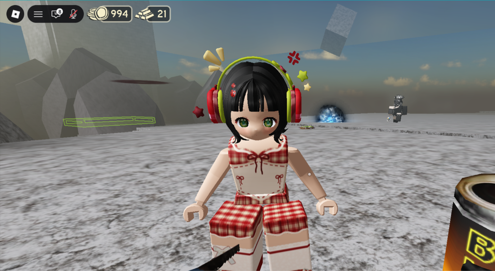
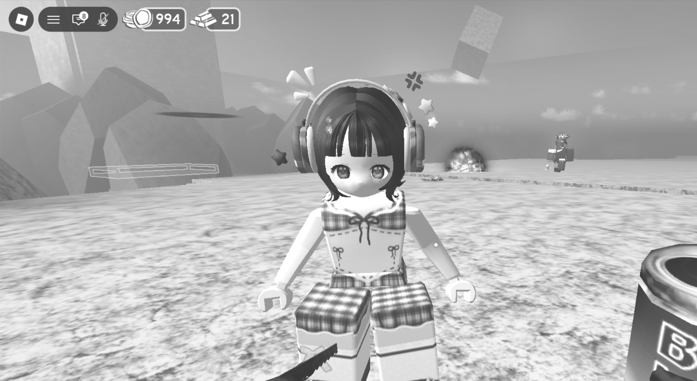
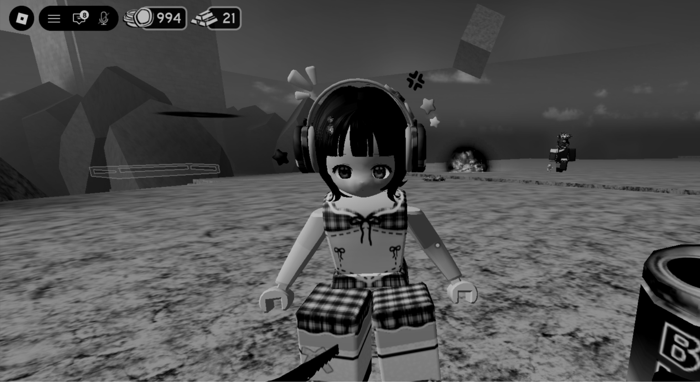
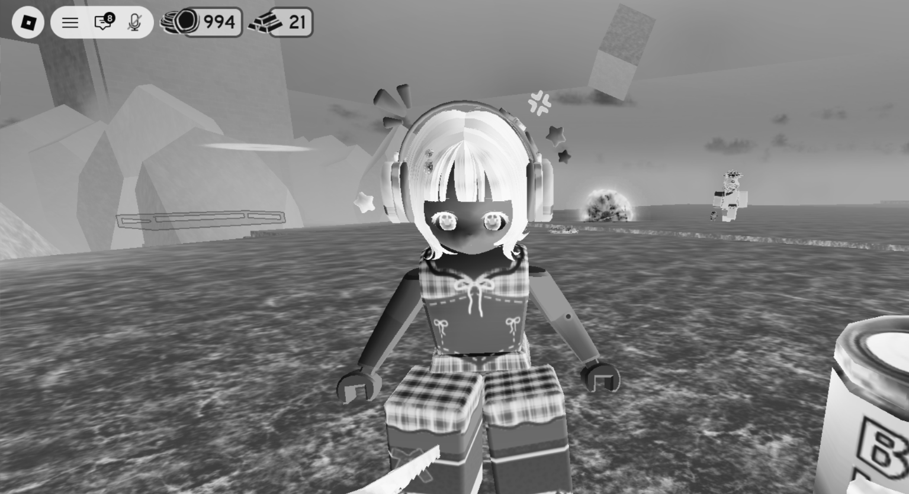
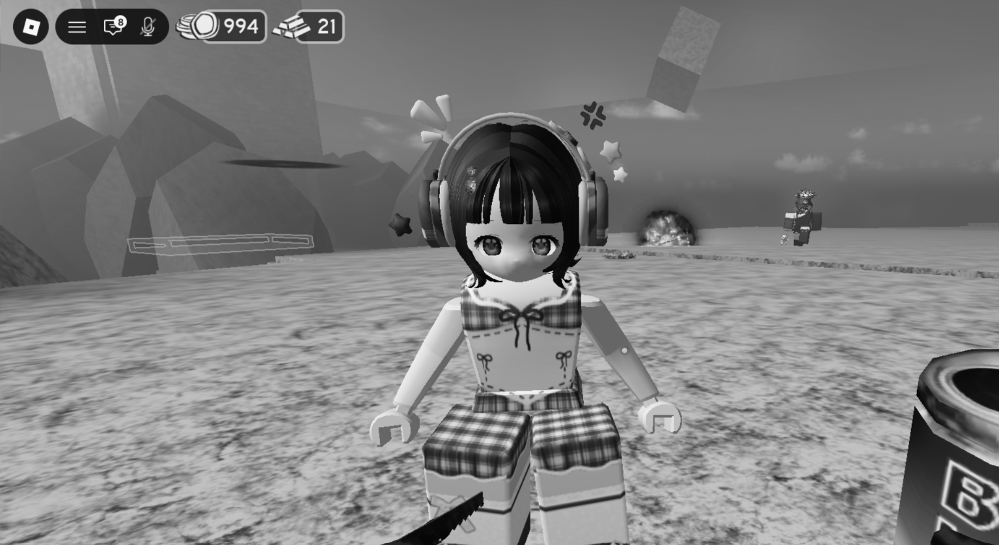
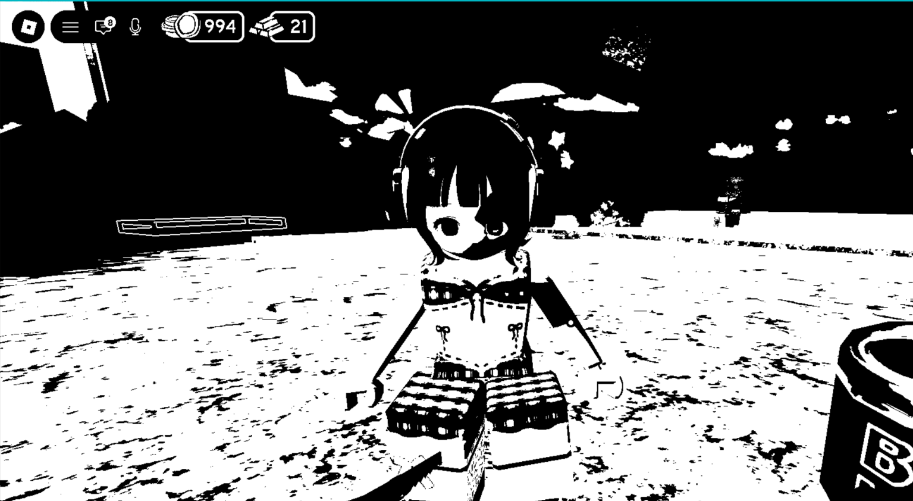
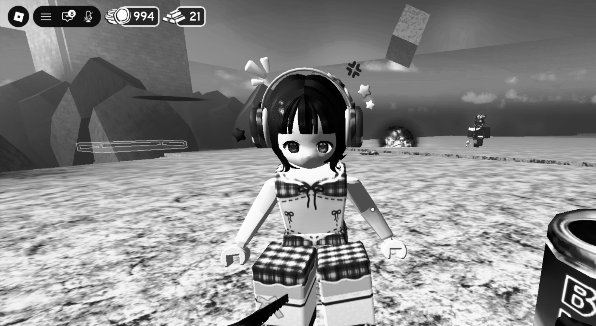

# Tugas 2 PCV

Tugas ini membahas penerapan **Transformasi Intensitas** dan **Histogram Equalization** pada gambar.

Proses yang dilakukan pada program ini meliputi:

* Grayscale secara manual
* Brightness
* Darkness
* Negative Image
* Contrast Stretching
* Thresholding
* Histogram secara manual
* CDF (Cumulative Distribution Function) secara manual
* Histogram Equalization secara manual

Pada tugas ini, proses transformasi dan histogram dibuat secara manual menggunakan perulangan dan perhitungan matematis. Fungsi khusus seperti `cv2.equalizeHist()` tidak digunakan untuk melakukan proses histogram equalization.

---

## 1. Transformasi Intensitas

**Transformasi intensitas** adalah proses mengubah nilai intensitas atau tingkat kecerahan pada setiap piksel gambar dari nilai awal menjadi nilai baru.

Pada gambar grayscale 8-bit, nilai intensitas berada pada rentang:

* `0` → hitam
* `255` → putih
* Nilai di antara `0–255` → tingkat keabuan

Secara umum, transformasi intensitas dapat dituliskan sebagai:

$$
s = T(r)
$$

di mana:

* `r` = nilai intensitas piksel sebelum transformasi
* `s` = nilai intensitas piksel setelah transformasi
* `T` = fungsi transformasi

Pada program ini terdapat beberapa transformasi intensitas, yaitu **Brightness, Darkness, Negative Image, Contrast Stretching**, dan **Thresholding**.

### Brightness

Brightness digunakan untuk **mencerahkan gambar** dengan menambahkan nilai tertentu pada setiap intensitas piksel.

Rumus yang digunakan:

$$
s = r + C
$$

Pada program, nilai `C` adalah `50`. Artinya, nilai intensitas setiap piksel ditambah 50.

Jika hasil penjumlahan melebihi `255`, maka nilainya dibatasi menjadi `255`.

---

### Darkness

Darkness digunakan untuk **menggelapkan gambar** dengan mengurangi nilai intensitas setiap piksel.

Rumus yang digunakan:

$$
s = r - C
$$

Pada program, nilai `C` adalah `50`.

Jika hasil pengurangan kurang dari `0`, maka nilainya dibatasi menjadi `0`.

---

### Negative Image

Negative image digunakan untuk membalik nilai intensitas gambar.

Rumus yang digunakan:

$$
s = 255-r
$$

Dengan rumus tersebut, piksel yang awalnya gelap akan menjadi terang, sedangkan piksel yang awalnya terang akan menjadi gelap.

Contohnya:

* `0` → `255`
* `50` → `205`
* `100` → `155`
* `200` → `55`
* `255` → `0`

---

### Contrast Stretching

Contrast stretching digunakan untuk **memperlebar rentang intensitas** yang digunakan oleh gambar sehingga perbedaan antara bagian gelap dan terang menjadi lebih jelas.

Program mencari nilai intensitas minimum (`r_min`) dan maksimum (`r_max`) terlebih dahulu.

Rumus yang digunakan:

$$
s =
\frac{r-r_{min}}
{r_{max}-r_{min}}
\times255
$$

Jika gambar hanya memiliki satu nilai intensitas sehingga `r_max == r_min`, gambar tidak diubah.

Contrast stretching memiliki tujuan yang mirip dengan histogram equalization, yaitu meningkatkan kontras. Namun, contrast stretching menggunakan nilai minimum dan maksimum intensitas sebagai dasar pemetaan, sedangkan histogram equalization menggunakan distribusi histogram dan CDF.

---

### Thresholding

Thresholding digunakan untuk mengubah gambar grayscale menjadi gambar dengan dua nilai intensitas, yaitu hitam dan putih.

Pada program digunakan nilai threshold `128`.

Aturannya:

* Jika `r >= 128`, maka piksel menjadi `255` atau putih.
* Jika `r < 128`, maka piksel menjadi `0` atau hitam.

Dengan demikian, gambar grayscale diubah menjadi gambar biner.

---

## 2. Histogram

Histogram merupakan representasi jumlah piksel pada setiap nilai intensitas.

Pada gambar grayscale 8-bit terdapat `256` kemungkinan nilai intensitas, yaitu dari `0` sampai `255`.

Pada program, histogram dibuat secara manual menggunakan:

```python
histogram = [0] * 256
```

Kemudian setiap piksel diperiksa dan jumlah piksel pada intensitas tersebut ditambahkan.

Contohnya, jika terdapat 100 piksel yang memiliki intensitas `50`, maka:

```python
histogram[50] = 100
```

Histogram digunakan sebagai dasar untuk proses histogram equalization.

---

## 3. CDF (Cumulative Distribution Function)

CDF atau **Cumulative Distribution Function** merupakan jumlah kumulatif piksel dari intensitas terendah sampai intensitas tertentu.

Rumus sederhananya:

$$
CDF(i)=\sum_{j=0}^{i}Histogram(j)
$$

Artinya, CDF pada suatu intensitas merupakan jumlah seluruh piksel yang memiliki intensitas **lebih kecil atau sama dengan** intensitas tersebut.

Pada program, CDF dihitung secara manual:

```python
cdf[0] = histogram[0]

for i in range(1, 256):
    cdf[i] = cdf[i - 1] + histogram[i]
```

CDF kemudian digunakan untuk menentukan pemetaan intensitas baru pada proses histogram equalization.

---

## 4. Histogram Equalization

Histogram equalization merupakan proses untuk meningkatkan kontras gambar dengan mengubah nilai intensitas berdasarkan distribusi histogram gambar.

Berbeda dengan contrast stretching yang menggunakan `r_min` dan `r_max`, histogram equalization menggunakan **CDF** untuk menentukan nilai intensitas baru.

Rumus yang digunakan:

$$
s =
\frac{CDF(r)-CDF_{min}}
{N-CDF_{min}}
\times255
$$

di mana:

* `CDF(r)` = nilai CDF pada intensitas `r`
* `CDF_min` = nilai CDF terkecil yang tidak bernilai nol
* `N` = jumlah seluruh piksel
* `s` = intensitas baru

Prosesnya dilakukan dengan membuat mapping untuk setiap kemungkinan intensitas dari `0` sampai `255`.

Setelah mapping selesai, setiap piksel pada gambar grayscale diganti dengan nilai baru berdasarkan mapping tersebut.

Dengan demikian, histogram gambar dapat menjadi lebih tersebar pada rentang intensitas yang tersedia sehingga kontras gambar meningkat.

---

## 5. Source Code

Berikut adalah source code lengkap yang digunakan pada project ini.

```python
import cv2
import numpy as np

# ============================================================
# BACA GAMBAR
# ============================================================

image = cv2.imread("rb.png")

if image is None:
    print("Gambar tidak ditemukan!")
    exit()

height = image.shape[0]
width = image.shape[1]


# ============================================================
# 1. GRAYSCALE MANUAL
# ============================================================
# OpenCV membaca gambar dalam format BGR.
#
# Rumus grayscale:
# Gray = 0.299R + 0.587G + 0.114B

gray = np.zeros((height, width), dtype=np.uint8)

for y in range(height):
    for x in range(width):

        B = int(image[y, x, 0])
        G = int(image[y, x, 1])
        R = int(image[y, x, 2])

        nilai_gray = 0.114 * B + 0.587 * G + 0.299 * R

        gray[y, x] = int(nilai_gray)


# ============================================================
# 2. TRANSFORMASI INTENSITAS
# ============================================================


# ------------------------------------------------------------
# A. BRIGHTNESS - MENCERAHKAN GAMBAR
# ------------------------------------------------------------
# Rumus:
# s = r + C

C = 50

brightness = np.zeros((height, width), dtype=np.uint8)

for y in range(height):
    for x in range(width):

        r = int(gray[y, x])

        s = r + C

        if s > 255:
            s = 255

        brightness[y, x] = s


# ------------------------------------------------------------
# B. DARKNESS - MENGGELAPKAN GAMBAR
# ------------------------------------------------------------
# Rumus:
# s = r - C

C = 50

darkness = np.zeros((height, width), dtype=np.uint8)

for y in range(height):
    for x in range(width):

        r = int(gray[y, x])

        s = r - C

        if s < 0:
            s = 0

        darkness[y, x] = s


# ------------------------------------------------------------
# C. NEGATIVE IMAGE
# ------------------------------------------------------------
# Rumus:
# s = 255 - r

negative = np.zeros((height, width), dtype=np.uint8)

for y in range(height):
    for x in range(width):

        r = int(gray[y, x])

        s = 255 - r

        negative[y, x] = s


# ------------------------------------------------------------
# D. CONTRAST STRETCHING
# ------------------------------------------------------------
# Tujuan:
# Memperlebar rentang intensitas gambar.
#
# Rumus:
#
# s = ((r - r_min) / (r_max - r_min)) * 255

# Mencari intensitas minimum dan maksimum secara manual

r_min = 255
r_max = 0

for y in range(height):
    for x in range(width):

        r = int(gray[y, x])

        if r < r_min:
            r_min = r

        if r > r_max:
            r_max = r


contrast = np.zeros((height, width), dtype=np.uint8)

if r_max == r_min:

    # Jika semua piksel memiliki nilai yang sama
    for y in range(height):
        for x in range(width):
            contrast[y, x] = gray[y, x]

else:

    for y in range(height):
        for x in range(width):

            r = int(gray[y, x])

            s = ((r - r_min) / (r_max - r_min)) * 255

            if s > 255:
                s = 255

            if s < 0:
                s = 0

            contrast[y, x] = int(s)


# ------------------------------------------------------------
# E. THRESHOLDING
# ------------------------------------------------------------
# Threshold mengubah gambar menjadi hitam dan putih.
#
# Jika intensitas >= threshold → 255
# Jika intensitas < threshold  → 0

threshold_value = 128

threshold = np.zeros((height, width), dtype=np.uint8)

for y in range(height):
    for x in range(width):

        r = int(gray[y, x])

        if r >= threshold_value:
            threshold[y, x] = 255
        else:
            threshold[y, x] = 0


# ============================================================
# 3. HISTOGRAM MANUAL
# ============================================================
# histogram[i] =
# jumlah piksel yang mempunyai intensitas i

histogram = [0] * 256

for y in range(height):
    for x in range(width):

        nilai = int(gray[y, x])

        histogram[nilai] += 1


# ============================================================
# 4. CDF MANUAL
# ============================================================
# CDF[i] =
# jumlah piksel dengan intensitas <= i

cdf = [0] * 256

cdf[0] = histogram[0]

for i in range(1, 256):

    cdf[i] = cdf[i - 1] + histogram[i]


# ============================================================
# 5. CARI CDF MINIMUM
# ============================================================

cdf_min = 0

for i in range(256):

    if cdf[i] != 0:
        cdf_min = cdf[i]
        break


# ============================================================
# 6. HISTOGRAM EQUALIZATION
# ============================================================
#
# Rumus:
#
# s = ((CDF(r) - CDF_min)
#      / (N - CDF_min)) * 255

jumlah_pixel = height * width

mapping = [0] * 256

for i in range(256):

    if jumlah_pixel == cdf_min:

        mapping[i] = 0

    else:

        nilai_baru = (
            (cdf[i] - cdf_min)
            / (jumlah_pixel - cdf_min)
        ) * 255

        if nilai_baru > 255:
            nilai_baru = 255

        if nilai_baru < 0:
            nilai_baru = 0

        mapping[i] = int(nilai_baru)


# ============================================================
# 7. TERAPKAN MAPPING KE GAMBAR
# ============================================================

equalized = np.zeros((height, width), dtype=np.uint8)

for y in range(height):
    for x in range(width):

        nilai_lama = int(gray[y, x])

        nilai_baru = mapping[nilai_lama]

        equalized[y, x] = nilai_baru


# ============================================================
# 8. TAMPILKAN HASIL
# ============================================================

cv2.imshow("Gambar Asli", image)

cv2.imshow("Grayscale", gray)

cv2.imshow("Brightness", brightness)

cv2.imshow("Darkness", darkness)

cv2.imshow("Negative", negative)

cv2.imshow("Contrast Stretching", contrast)

cv2.imshow("Thresholding", threshold)

cv2.imshow("Histogram Equalization", equalized)

cv2.waitKey(0)
cv2.destroyAllWindows()
```

---

# 6. Hasil Transformasi Intensitas

## Gambar Asli



Gambar di atas merupakan gambar asli yang dibaca menggunakan fungsi `cv2.imread("rb.png")`. Pada tahap ini, gambar belum mengalami transformasi intensitas sehingga nilai piksel masih menggunakan nilai warna asli dari gambar.

---

## Grayscale


Gambar diubah menjadi grayscale secara manual dengan menggunakan rumus:

$$
Gray = 0.299R + 0.587G + 0.114B
$$

Nilai Red, Green, dan Blue dari setiap piksel dihitung untuk mendapatkan satu nilai intensitas grayscale. Hasilnya adalah gambar yang hanya memiliki tingkat keabuan dari `0` sampai `255`.

Nilai `0` menunjukkan warna hitam, sedangkan nilai `255` menunjukkan warna putih.

---

## Brightness



Gambar menjadi lebih terang karena nilai intensitas setiap piksel ditambahkan sebesar `50`.

Rumus yang digunakan adalah:

$$
s = r + 50
$$

Sebagai contoh, jika suatu piksel awalnya memiliki intensitas `100`, maka setelah transformasi menjadi:

$$
100 + 50 = 150
$$

Jika hasil penjumlahan melebihi `255`, maka nilainya dibatasi menjadi `255`. Oleh karena itu, keseluruhan gambar terlihat lebih terang dibandingkan gambar grayscale.

---

## Darkness



Gambar menjadi lebih gelap karena nilai intensitas setiap piksel dikurangi sebesar `50`.

Rumus yang digunakan adalah:

$$
s = r - 50
$$

Sebagai contoh, jika suatu piksel memiliki intensitas `150`, maka setelah transformasi menjadi:

$$
150 - 50 = 100
$$

Jika hasil pengurangan kurang dari `0`, maka nilainya dibatasi menjadi `0`. Karena intensitas setiap piksel dikurangi, gambar terlihat lebih gelap dibandingkan gambar grayscale.

---

## Negative Image



Gambar terlihat seperti negatif karena nilai intensitas setiap piksel dibalik menggunakan rumus:

$$
s = 255-r
$$

Piksel yang awalnya memiliki intensitas tinggi akan menjadi rendah, sedangkan piksel yang awalnya memiliki intensitas rendah akan menjadi tinggi.

Sebagai contoh:

$$
0 \rightarrow 255
$$

$$
100 \rightarrow 155
$$

$$
255 \rightarrow 0
$$

Oleh karena itu, bagian gambar yang awalnya terang menjadi gelap dan bagian yang awalnya gelap menjadi terang.

---

## Contrast Stretching



Gambar mengalami peningkatan kontras karena rentang intensitas gambar diperlebar berdasarkan nilai intensitas minimum dan maksimum.

Program terlebih dahulu mencari `r_min` dan `r_max` dari seluruh piksel gambar. Setelah itu, setiap nilai intensitas dipetakan menggunakan rumus:

$$
s =
\frac{r-r_{min}}
{r_{max}-r_{min}}
\times255
$$

Intensitas yang sebelumnya berada di antara `r_min` dan `r_max` dipetakan ke rentang yang lebih luas, yaitu `0` sampai `255`.

Akibatnya, perbedaan antara bagian gambar yang gelap dan terang menjadi lebih terlihat sehingga kontras gambar meningkat.

---

## Thresholding



Gambar berubah menjadi hitam dan putih karena setiap nilai intensitas dibandingkan dengan nilai threshold `128`.

Aturan yang digunakan adalah:

$$
r \geq 128 \rightarrow 255
$$

$$
r < 128 \rightarrow 0
$$

Piksel dengan intensitas minimal `128` diubah menjadi putih, sedangkan piksel dengan intensitas kurang dari `128` diubah menjadi hitam.

Karena hanya terdapat dua kemungkinan nilai intensitas, yaitu `0` dan `255`, hasil akhirnya berupa gambar biner.

---

# 7. Hasil Histogram Equalization

## Histogram Equalization



Gambar mengalami perubahan kontras karena nilai intensitas setiap piksel dipetakan kembali berdasarkan histogram dan CDF.

Pertama, program menghitung jumlah piksel pada setiap intensitas melalui histogram. Kemudian histogram tersebut digunakan untuk menghitung CDF atau jumlah kumulatif piksel.

Setelah mendapatkan CDF, program mencari nilai `CDF_min` dan menggunakan rumus histogram equalization untuk menentukan nilai intensitas baru:

$$
s =
\frac{CDF(r)-CDF_{min}}
{N-CDF_{min}}
\times255
$$

Nilai intensitas baru tersebut disimpan ke dalam `mapping`. Selanjutnya, setiap piksel pada gambar grayscale diganti berdasarkan mapping tersebut.

Proses ini membuat distribusi intensitas gambar menjadi lebih tersebar pada rentang intensitas yang tersedia. Akibatnya, perbedaan antara bagian yang gelap dan terang dapat menjadi lebih jelas sehingga kontras gambar meningkat.

Berbeda dengan contrast stretching yang hanya menggunakan nilai minimum dan maksimum, histogram equalization mempertimbangkan **jumlah piksel pada setiap intensitas melalui histogram dan CDF**.
