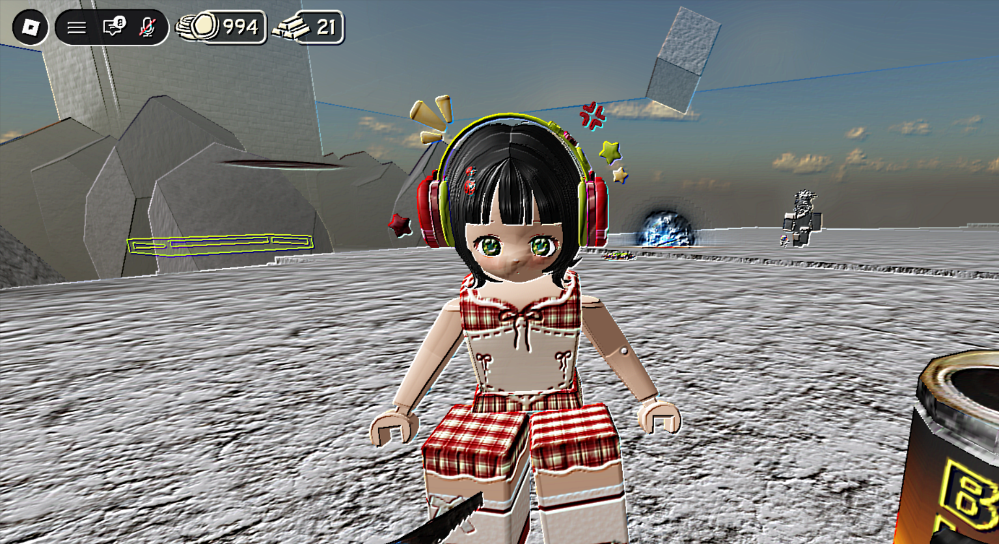
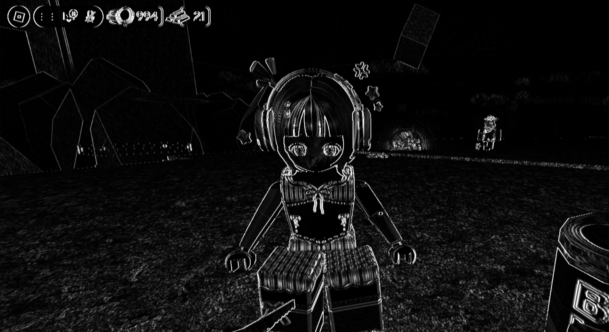
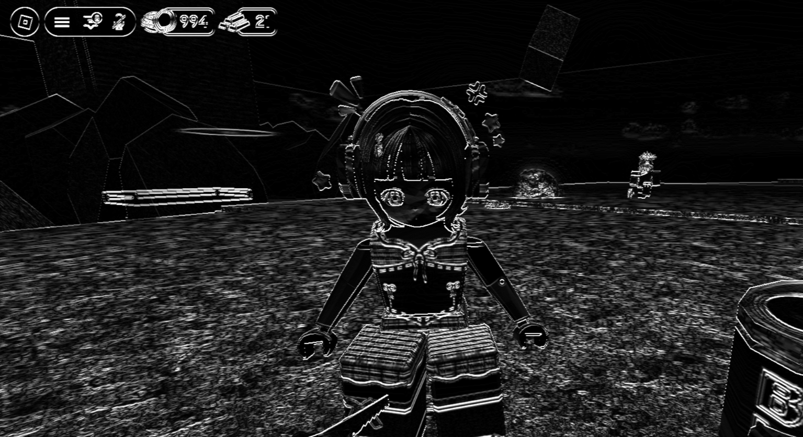
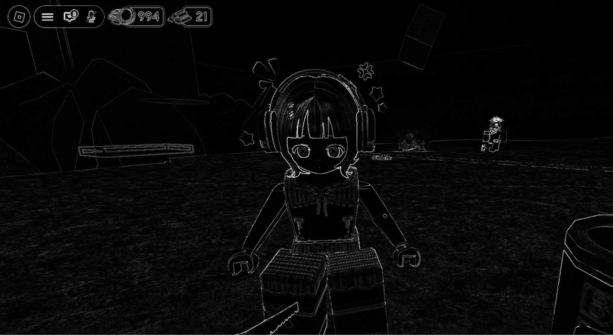

# Tugas 3 PCV

Tugas ini membahas penerapan **Filter Spasial pada Citra** menggunakan operasi pada neighborhood atau kumpulan piksel di sekitar suatu piksel.

Proses yang dilakukan pada program ini meliputi:

* Original Image
* Mean / Average Filter
* Gaussian Blur
* Median Filter
* Sharpening
* Emboss
* Sobel X
* Sobel Y
* Laplacian

Pada tugas ini, proses filtering dilakukan secara manual menggunakan **NumPy**. Setiap filter menggunakan kernel atau aturan tertentu yang diterapkan pada piksel beserta piksel-piksel di sekitarnya.

Fungsi filtering khusus seperti `cv2.blur()`, `cv2.GaussianBlur()`, `cv2.medianBlur()`, `cv2.Sobel()`, dan `cv2.Laplacian()` tidak digunakan untuk melakukan proses filtering.

---

# 1. Filter Spasial

**Filter spasial** adalah proses mengubah nilai suatu piksel berdasarkan nilai piksel-piksel yang berada di sekitarnya.

Piksel yang sedang diproses disebut sebagai **piksel pusat**, sedangkan kumpulan piksel di sekitarnya disebut **neighborhood**.

Sebagai contoh, untuk kernel berukuran `3 × 3`, sebuah piksel akan diproses menggunakan sembilan nilai piksel:

```text
p1  p2  p3
p4  p5  p6
p7  p8  p9
```

Piksel `p5` merupakan piksel pusat.

Kernel juga memiliki ukuran yang sama:

```text
k1  k2  k3
k4  k5  k6
k7  k8  k9
```

Nilai piksel baru diperoleh dengan mengalikan setiap piksel dengan nilai kernel yang bersesuaian, kemudian menjumlahkan hasilnya.

Secara umum:

$$
g(x,y)=\sum_i\sum_j f(x+i,y+j)h(i,j)
$$

di mana:

* `f(x,y)` = gambar input
* `h(i,j)` = kernel
* `g(x,y)` = hasil filtering

Dengan demikian, filter spasial bekerja dengan cara **melihat piksel-piksel di sekitar suatu piksel dan menghitung nilai baru berdasarkan aturan filter tersebut**.

---

# 2. Padding

Pada bagian tepi gambar, tidak semua piksel memiliki tetangga yang lengkap.

Sebagai contoh, piksel yang berada di pojok kiri atas tidak mempunyai piksel di sebelah kiri dan di atasnya.

Agar kernel tetap dapat diterapkan pada bagian tepi gambar, program menggunakan:

```python
np.pad(..., mode="edge")
```

`mode="edge"` bekerja dengan cara menggunakan nilai piksel yang berada pada tepi gambar untuk mengisi bagian padding.

Sebagai contoh:

```text
Gambar asli:         Mode edge :
 
                 10  10  20  30  30
10  20  30       10  10  20  30  30
40  50  60       40  40  50  60  60
70  80  90       70  70  80  90  90
                 70  70  80  90  90

```

Pada bagian luar gambar, nilai tepi diperpanjang sehingga proses kernel `3 × 3` tetap dapat dilakukan pada piksel paling luar.

Dengan demikian, ukuran gambar hasil filtering tetap sama dengan ukuran gambar awal.

---

# 3. Hasil Filtering Spasial

## Gambar Asli


Gambar ini merupakan gambar asli yang digunakan sebagai input program.

Pada tahap ini belum ada operasi filtering yang dilakukan. Setiap piksel masih mempunyai nilai asli dari gambar.

Gambar asli digunakan sebagai pembanding untuk melihat perubahan yang terjadi setelah setiap filter diterapkan.

---

# 4. Mean Filter / Average Filter


**Mean Filter** atau **Average Filter** digunakan untuk melakukan **blur atau smoothing** pada gambar.

Kernel yang digunakan adalah kernel `3 × 3` dengan semua nilai sama:

$$
K=
\frac{1}{9}
\begin{bmatrix}
1&1&1\\
1&1&1\\
1&1&1
\end{bmatrix}
$$

Artinya, setiap piksel baru dihitung menggunakan rata-rata dari sembilan piksel yang berada di sekitarnya.

### Contoh proses

Misalnya terdapat neighborhood:

```text
10   20   30
40   50   60
70   80   90
```

Kernel Mean Filter:

```text
1/9   1/9   1/9
1/9   1/9   1/9
1/9   1/9   1/9
```

Maka nilai piksel tengah yang baru adalah:

$$
\frac{
10+20+30+40+50+60+70+80+90
}{9}
$$

Jumlah seluruh piksel:

$$
10+20+30+40+50+60+70+80+90=450
$$

Kemudian:

$$
\frac{450}{9}=50
$$

Jadi nilai piksel tengah tetap menjadi `50`.

Namun, jika nilai piksel di sekitarnya berbeda jauh, rata-rata tersebut akan membuat nilai piksel menjadi lebih mendekati nilai tetangganya.

### Mengapa gambar menjadi blur?

Misalnya terdapat bagian gambar dengan perubahan intensitas yang sangat tajam:

```text
20   20   20
20  255  255
20  255  255
```

Piksel `255` yang berada dekat dengan piksel `20` akan dihitung bersama-sama.

Hasil rata-ratanya:

$$
\frac{
20+20+20+20+255+255+20+255+255
}{9}
$$

$$
=\frac{1120}{9}
\approx124
$$

Nilai `255` yang sebelumnya sangat terang dapat berubah menjadi sekitar `124`.

Sebaliknya, piksel `20` di sekitar daerah terang juga dapat meningkat.

Jadi perbedaan yang sangat tajam antara piksel gelap dan terang menjadi lebih kecil.

**Inilah yang menyebabkan gambar terlihat lebih halus dan blur.**

Mean Filter juga dapat mengurangi detail kecil dan noise karena setiap piksel tidak lagi hanya bergantung pada nilai dirinya sendiri, tetapi dipengaruhi oleh rata-rata piksel di sekitarnya.

---

# 5. Gaussian Blur


**Gaussian Blur** juga digunakan untuk melakukan smoothing atau pengaburan gambar.

Perbedaannya dengan Mean Filter adalah bahwa Gaussian Blur **tidak memberikan bobot yang sama kepada semua piksel**.

Kernel Gaussian yang digunakan pada program adalah:

$$
K=
\frac{1}{256}
\begin{bmatrix}
1&4&6&4&1\\
4&16&24&16&4\\
6&24&36&24&6\\
4&16&24&16&4\\
1&4&6&4&1
\end{bmatrix}
$$

Kernel tersebut berukuran `5 × 5`.

Nilai terbesar berada di bagian tengah kernel:

```text
1   4   6   4   1
4  16  24  16   4
6  24  36  24   6
4  16  24  16   4
1   4   6   4   1
```

Nilai tengah `36` merupakan nilai terbesar sehingga piksel yang paling dekat dengan pusat mendapatkan pengaruh yang lebih besar.

### Contoh sederhana

Misalnya bagian gambar memiliki nilai:

```text
10  10  20  10  10
10  20  30  20  10
20  30 100  30  20
10  20  30  20  10
10  10  20  10  10
```

Nilai `100` berada di tengah.

Pada Gaussian Blur, piksel `100` mendapatkan bobot yang lebih besar karena berada tepat di pusat kernel, sedangkan piksel yang semakin jauh mendapatkan bobot yang lebih kecil.

Dengan demikian, pengaruh piksel tidak diberikan secara sama rata seperti Mean Filter.

### Mengapa Gaussian Blur menghasilkan gambar yang halus?

Gaussian Blur membuat piksel pusat dipengaruhi lebih kuat oleh piksel yang dekat dengannya.

Perubahan intensitas yang sangat tajam akan dibuat lebih bertahap.

Contohnya, jika terdapat:

```text
20  20  20
20 255 255
20 255 255
```

maka nilai `255` tidak langsung dipertahankan sebagai nilai yang sangat tinggi pada piksel tertentu. Nilainya akan dipengaruhi oleh piksel di sekitarnya.

Hasilnya adalah transisi antara area gelap dan terang menjadi lebih halus.

Gaussian Blur sering digunakan untuk **mengurangi noise dan menghaluskan gambar sebelum proses deteksi tepi**.

---

# 6. Median Filter


**Median Filter** digunakan untuk melakukan smoothing dengan mengambil **nilai tengah (median)** dari piksel-piksel pada neighborhood.

Pada program digunakan neighborhood `3 × 3`.

Berbeda dengan Mean Filter yang menggunakan rata-rata, Median Filter mengurutkan nilai piksel kemudian mengambil nilai tengah.

### Contoh

Misalnya neighborhood:

```text
10   10   10
10  255   10
10   10   10
```

Jika semua nilai tersebut dimasukkan ke dalam satu daftar:

```text
10, 10, 10, 10, 255, 10, 10, 10, 10
```

Kemudian diurutkan:

```text
10, 10, 10, 10, 10, 10, 10, 10, 255
```

Nilai tengah dari sembilan angka tersebut adalah:

```text
10
```

Maka nilai piksel tengah `255` akan berubah menjadi:

```text
10
```

### Mengapa Median Filter dapat menghilangkan noise?

Misalnya terdapat noise berupa satu piksel yang nilainya sangat berbeda dari lingkungan:

```text
50   50   50
50  255   50
50   50   50
```

Jika menggunakan Mean Filter:

$$
\frac{50+50+50+50+255+50+50+50+50}{9}
$$

hasilnya menjadi sekitar:

$$
72.8
$$

Nilai `255` masih memengaruhi hasil rata-rata.

Sedangkan Median Filter menghasilkan:

```text
50
```

karena `50` merupakan nilai tengah setelah data diurutkan.

Oleh karena itu, Median Filter sangat berguna untuk mengurangi **noise berupa piksel yang memiliki nilai sangat berbeda dari piksel di sekitarnya**, sementara struktur gambar masih relatif dipertahankan.

---

# 7. Sharpening


**Sharpening** digunakan untuk meningkatkan ketajaman gambar.

Kernel yang digunakan adalah:

$$
K=
\begin{bmatrix}
0&-1&0\\
-1&5&-1\\
0&-1&0
\end{bmatrix}
$$

Pada kernel tersebut, piksel pusat mempunyai bobot `5`, sedangkan piksel di atas, bawah, kiri, dan kanan mempunyai bobot `-1`.

### Contoh perhitungan

Misalnya neighborhood:

```text
50   50   50
50  100   50
50   50   50
```

Kemudian kernel:

```text
 0  -1   0
-1   5  -1
 0  -1   0
```

Maka:

$$
(0\times50)
+(-1\times50)
+(0\times50)
$$

$$
+(-1\times50)
+(5\times100)
+(-1\times50)
$$

$$
+(0\times50)
+(-1\times50)
+(0\times50)
$$

Sehingga:

$$
-50-50+500-50-50
$$

$$
=300
$$

Nilai tersebut kemudian dibatasi pada rentang `0–255`.

### Mengapa gambar menjadi lebih tajam?

Kernel mempertahankan piksel pusat dengan bobot besar, tetapi mengurangi pengaruh piksel di sekitarnya.

Pada daerah yang memiliki perubahan intensitas, hasilnya akan menghasilkan perbedaan yang lebih kuat.

Misalnya terdapat transisi:

```text
50  50  200  200
```

Daerah transisi antara `50` dan `200` akan mendapatkan respons yang lebih kuat.

Akibatnya, batas antara objek dan background menjadi lebih jelas.

Jadi logika sharpening adalah **meningkatkan perbedaan intensitas di sekitar perubahan atau detail gambar sehingga detail terlihat lebih tajam**.

---

# 8. Emboss



**Emboss** digunakan untuk memberikan efek seperti permukaan gambar terlihat timbul atau memiliki kedalaman.

Kernel yang digunakan:

$$
K=
\begin{bmatrix}
-2&-1&0\\
-1&1&1\\
0&1&2
\end{bmatrix}
$$

Kernel ini memberikan bobot negatif pada satu sisi dan bobot positif pada sisi lainnya.

### Contoh

Misalnya terdapat perubahan intensitas dari kiri ke kanan:

```text
20   20   20
20  100  180
20  100  180
```

Kernel akan memberikan nilai negatif pada beberapa piksel di satu sisi dan nilai positif pada sisi lainnya.

Perubahan intensitas tersebut menghasilkan perbedaan nilai yang kuat.

### Mengapa muncul efek seperti timbul?

Kernel Emboss dirancang untuk menghasilkan perbedaan antara bagian gambar yang lebih gelap dan bagian yang lebih terang.

Ketika terdapat perubahan intensitas:

```text
gelap → terang
```

kernel memberikan respons yang berbeda pada kedua sisi tersebut.

Akibatnya, batas objek dapat terlihat seperti memiliki:

```text
satu sisi terang
satu sisi gelap
```

Kombinasi terang dan gelap tersebut membuat mata manusia menangkap adanya efek **kedalaman atau permukaan yang timbul**.

Jadi Emboss bukan sekadar membuat gambar lebih tajam, tetapi membuat perubahan intensitas memiliki arah tertentu sehingga muncul efek tiga dimensi secara visual.

---

# 9. Sobel X



**Sobel X** digunakan untuk mendeteksi perubahan intensitas yang berkaitan dengan arah horizontal, sehingga terutama digunakan untuk menemukan **tepi vertikal** pada gambar.

Kernel Sobel X:

$$
K_x=
\begin{bmatrix}
-1&0&1\\
-2&0&2\\
-1&0&1
\end{bmatrix}
$$

Perhatikan bahwa bagian kiri memiliki nilai negatif dan bagian kanan memiliki nilai positif.

### Contoh

Misalnya terdapat tepi vertikal:

```text
20   20   200
20   20   200
20   20   200
```

Pada bagian kiri nilai piksel relatif kecil:

```text
20
```

sedangkan bagian kanan memiliki nilai lebih besar:

```text
200
```

Kernel Sobel X membandingkan kedua sisi tersebut.

Bagian kiri dikalikan dengan nilai negatif:

```text
20 × -1
20 × -2
20 × -1
```

sedangkan bagian kanan dikalikan dengan nilai positif:

```text
200 × 1
200 × 2
200 × 1
```

Perbedaan tersebut menghasilkan nilai yang besar.

### Mengapa tepi terdeteksi?

Jika daerah gambar memiliki intensitas yang hampir sama:

```text
100 100 100
100 100 100
100 100 100
```

bagian kiri dan kanan hampir saling meniadakan.

Namun jika terdapat perubahan:

```text
20   20   200
20   20   200
20   20   200
```

perbedaannya besar sehingga respons Sobel juga besar.

Jadi Sobel X mendeteksi lokasi yang mengalami perubahan intensitas pada arah horizontal dan hasil visualnya terutama menonjolkan **garis atau tepi vertikal**.

---

# 10. Sobel Y



**Sobel Y** digunakan untuk mendeteksi perubahan intensitas pada arah vertikal dan terutama digunakan untuk menemukan **tepi horizontal**.

Kernel Sobel Y:

$$
K_y=
\begin{bmatrix}
-1&-2&-1\\
0&0&0\\
1&2&1
\end{bmatrix}
$$

Pada kernel tersebut, bagian atas mempunyai nilai negatif sedangkan bagian bawah mempunyai nilai positif.

### Contoh

Misalnya terdapat perubahan intensitas:

```text
20   20   20
20   20   20
200 200 200
```

Bagian atas mempunyai nilai:

```text
20
```

sedangkan bagian bawah:

```text
200
```

Kernel Sobel Y membandingkan bagian atas dengan bagian bawah.

Bagian atas diberi bobot negatif:

```text
20 × -1
20 × -2
20 × -1
```

sedangkan bagian bawah diberi bobot positif:

```text
200 × 1
200 × 2
200 × 1
```

Perbedaan tersebut menghasilkan respons yang besar.

### Mengapa tepi horizontal terlihat?

Ketika tidak terdapat perubahan vertikal:

```text
100 100 100
100 100 100
100 100 100
```

hasil kernel relatif kecil.

Namun ketika terdapat perubahan:

```text
20   20   20
20   20   20
200 200 200
```

perbedaan antara bagian atas dan bawah menjadi besar.

Akibatnya, garis batas tersebut akan terlihat pada hasil Sobel Y.

Jadi Sobel Y terutama menonjolkan **tepi horizontal**.

---

# 11. Laplacian



**Laplacian** digunakan untuk mendeteksi perubahan intensitas yang cepat pada gambar.

Kernel Laplacian yang digunakan adalah:

$$
K=
\begin{bmatrix}
0&1&0\\
1&-4&1\\
0&1&0
\end{bmatrix}
$$

Kernel ini menggunakan piksel pusat dengan bobot negatif dan piksel atas, bawah, kiri, serta kanan dengan bobot positif.

### Contoh perhitungan

Misalnya:

```text
50   50   50
50  200   50
50   50   50
```

Dengan kernel:

```text
 0   1   0
 1  -4   1
 0   1   0
```

Maka:

$$
(1\times50)
+(1\times50)
+(-4\times200)
+(1\times50)
+(1\times50)
$$

$$
=50+50-800+50+50
$$

$$
=-600
$$

Nilai tersebut menunjukkan adanya perubahan yang sangat kuat antara piksel pusat dan piksel di sekitarnya.

Karena hasil filtering dapat bernilai negatif, pada program hasil akhirnya disesuaikan kembali ke rentang intensitas gambar `0–255`.

### Mengapa Laplacian dapat mendeteksi tepi?

Jika semua piksel mempunyai nilai yang sama:

```text
100 100 100
100 100 100
100 100 100
```

maka:

$$
100+100-(4\times100)+100+100=0
$$

Hasilnya adalah `0`.

Artinya, tidak terdapat perubahan intensitas yang berarti.

Namun jika piksel pusat berbeda jauh:

```text
50   50   50
50  200   50
50   50   50
```

hasilnya menjadi sangat besar secara absolut.

Hal tersebut menunjukkan adanya perubahan intensitas yang tajam.

Dengan demikian, Laplacian dapat digunakan untuk menemukan **bagian gambar yang mengalami perubahan intensitas secara cepat**, terutama pada area tepi objek.

---

# 12. Perbedaan Setiap Filter

Secara umum, fungsi dari setiap proses pada program adalah:

| Filter         | Fungsi utama      | Prinsip                                    |
| -------------- | ----------------- | ------------------------------------------ |
| Mean / Average | Blur / smoothing  | Menggunakan rata-rata neighborhood         |
| Gaussian       | Blur / smoothing  | Menggunakan bobot Gaussian                 |
| Median         | Mengurangi noise  | Menggunakan nilai median                   |
| Sharpening     | Menajamkan gambar | Memperkuat perbedaan intensitas            |
| Emboss         | Efek timbul       | Memberikan respons arah terang-gelap       |
| Sobel X        | Deteksi tepi      | Mendeteksi perubahan arah X                |
| Sobel Y        | Deteksi tepi      | Mendeteksi perubahan arah Y                |
| Laplacian      | Deteksi tepi      | Mendeteksi perubahan intensitas yang cepat |

---

# 13. Urutan Hasil Program

Urutan gambar hasil yang digunakan dalam tugas ini adalah:

```text
1.png → Gambar Asli
2.png → Mean / Average Filter
3.png → Gaussian Blur
4.png → Median Filter
5.png → Sharpening
6.png → Emboss
7.png → Sobel X
8.png → Sobel Y
9.png → Laplacian
```

Secara konsep, proses filtering dapat dibagi menjadi tiga kelompok.

### Smoothing

```text
Mean Filter
Gaussian Blur
Median Filter
```

Ketiga filter tersebut digunakan untuk menghaluskan gambar atau mengurangi pengaruh noise.

Mean Filter menggunakan rata-rata, Gaussian menggunakan bobot Gaussian, sedangkan Median menggunakan nilai tengah dari neighborhood.

### Enhancement

```text
Sharpening
Emboss
```

Sharpening digunakan untuk meningkatkan ketajaman dan detail gambar.

Emboss menggunakan perbedaan intensitas berdasarkan arah tertentu untuk menghasilkan efek visual seperti permukaan yang timbul.

### Edge Detection

```text
Sobel X
Sobel Y
Laplacian
```

Ketiga proses tersebut digunakan untuk menemukan perubahan intensitas yang menunjukkan keberadaan tepi atau batas objek.

Sobel X dan Sobel Y memiliki arah tertentu, sedangkan Laplacian mendeteksi perubahan intensitas secara lebih umum.

---

# 14. Kesimpulan Proses

Filter spasial bekerja dengan cara mengambil nilai piksel di sekitar piksel yang sedang diproses, kemudian mengolah nilai tersebut menggunakan kernel atau aturan tertentu.

Perbedaan kernel menyebabkan setiap filter menghasilkan efek yang berbeda.

Mean Filter menghasilkan smoothing dengan menghitung rata-rata. Gaussian Blur melakukan smoothing dengan memberikan bobot yang lebih besar kepada piksel yang dekat dengan pusat. Median Filter mengambil nilai tengah sehingga efektif terhadap noise tertentu.

Sebaliknya, Sharpening memperkuat detail, Emboss memberikan efek timbul, sedangkan Sobel X, Sobel Y, dan Laplacian digunakan untuk menonjolkan perubahan intensitas yang berkaitan dengan tepi objek.

Dengan demikian, meskipun semua proses menggunakan konsep dasar **neighborhood dan operasi piksel**, perubahan kernel dan cara perhitungan menyebabkan hasil gambar yang berbeda.
