# Tugas 4 PCV

Tugas ini membahas **Model Warna pada Citra** menggunakan beberapa model warna, yaitu **RGB, CMYK, HSI, dan HSV**.

Proses yang dilakukan pada program ini meliputi:

* RGB
* CMYK - Cyan
* CMYK - Magenta
* CMYK - Yellow
* CMYK - Black
* HSI - Hue
* HSI - Saturation
* HSI - Intensity
* HSV - Hue
* HSV - Saturation
* HSV - Value

Pada tugas ini, proses konversi RGB ke CMYK, HSI, dan HSV dilakukan secara **manual menggunakan NumPy berdasarkan rumus masing-masing model warna**.

Program menggunakan OpenCV untuk membaca gambar dan mengubah format gambar dari BGR menjadi RGB. Setelah itu, proses konversi dilakukan menggunakan fungsi yang dibuat sendiri.

---

# 1. Model Warna RGB

**RGB (Red, Green, Blue)** merupakan model warna yang menggunakan tiga komponen utama, yaitu:

* Red (R)
* Green (G)
* Blue (B)

Setiap channel RGB memiliki nilai antara:

```text
0 - 255
```

Nilai ketiga channel tersebut menentukan warna dari setiap piksel.

Sebagai contoh:

```text
R = 255
G = 0
B = 0
```

menghasilkan warna merah.

Sedangkan:

```text
R = 0
G = 255
B = 0
```

menghasilkan warna hijau.

Dan:

```text
R = 0
G = 0
B = 255
```

menghasilkan warna biru.

Jika ketiga nilai memiliki nilai yang sama:

```text
R = G = B
```

maka warna yang dihasilkan adalah grayscale.

Contohnya:

```text
R = 0
G = 0
B = 0
```

adalah hitam.

Sedangkan:

```text
R = 255
G = 255
B = 255
```

adalah putih.

RGB merupakan model warna yang umum digunakan pada perangkat seperti monitor, kamera digital, dan layar komputer.

---

# 2. Konversi BGR ke RGB

OpenCV secara default membaca gambar menggunakan urutan channel:

```text
BGR
```

sedangkan rumus yang digunakan dalam tugas ini menggunakan:

```text
RGB
```

Oleh karena itu, setelah gambar dibaca menggunakan:

```python
image_bgr = cv2.imread(image_path)
```

gambar dikonversi menggunakan:

```python
image_rgb = cv2.cvtColor(
    image_bgr,
    cv2.COLOR_BGR2RGB
)
```

Proses tersebut mengubah urutan channel dari:

```text
B → G → R
```

menjadi:

```text
R → G → B
```

Sehingga nilai channel dapat digunakan dengan benar pada rumus RGB, CMYK, HSI, dan HSV.

---

# 3. Konversi RGB ke CMYK

**CMYK** merupakan model warna yang terdiri dari empat komponen:

* Cyan (C)
* Magenta (M)
* Yellow (Y)
* Black (K)

CMYK banyak digunakan pada proses pencetakan karena model ini bekerja berdasarkan kombinasi tinta.

Sebelum melakukan perhitungan, nilai RGB dinormalisasi dari:

```text
0 - 255
```

menjadi:

```text
0 - 1
```

Rumus normalisasi:

$$
R_n=\frac{R}{255}
$$

$$
G_n=\frac{G}{255}
$$

$$
B_n=\frac{B}{255}
$$

Setelah itu dilakukan konversi RGB menjadi CMY.

---

## 3.1 Cyan

Rumus Cyan:

$$
C=1-R
$$

Semakin besar nilai Red, maka nilai Cyan akan semakin kecil.

Sebaliknya, semakin kecil nilai Red, maka nilai Cyan akan semakin besar.

---

## 3.2 Magenta

Rumus Magenta:

$$
M=1-G
$$

Nilai Magenta diperoleh dari kebalikan channel Green setelah RGB dinormalisasi.

---

## 3.3 Yellow

Rumus Yellow:

$$
Y=1-B
$$

Nilai Yellow diperoleh dari kebalikan channel Blue.

---

## 3.4 Black

Nilai Black diperoleh dari nilai minimum C, M, dan Y:

$$
K=\min(C,M,Y)
$$

Setelah nilai K diperoleh, nilai C, M, dan Y dihitung kembali menggunakan:

$$
C'=\frac{C-K}{1-K}
$$

$$
M'=\frac{M-K}{1-K}
$$

$$
Y'=\frac{Y-K}{1-K}
$$

Perhitungan tersebut dilakukan untuk setiap piksel pada gambar.

Program juga menggunakan kondisi untuk menghindari pembagian dengan nol ketika:

$$
1-K=0
$$

---

# 4. Hasil Konversi CMYK

## 4.1 RGB

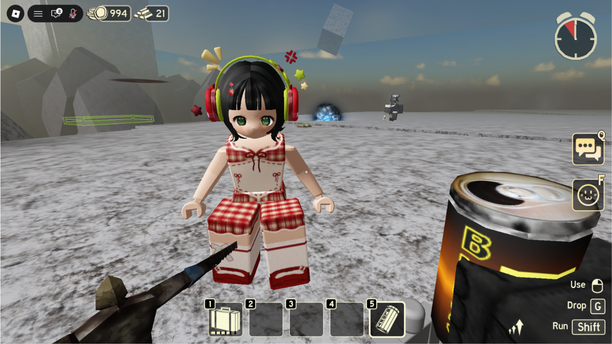

Gambar ini merupakan gambar asli dalam model warna RGB.

Gambar digunakan sebagai input sebelum dilakukan proses konversi ke model warna lainnya.

---

## 4.2 CMYK - Cyan

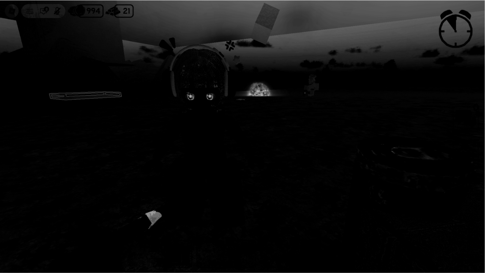

Gambar ini menunjukkan channel **Cyan (C)** hasil konversi dari RGB ke CMYK.

Channel Cyan diperoleh dari:

$$
C=1-R
$$

Nilai channel kemudian ditampilkan menggunakan grayscale sehingga bagian dengan nilai Cyan lebih tinggi akan memiliki intensitas yang lebih tinggi pada visualisasi.

---

## 4.3 CMYK - Magenta

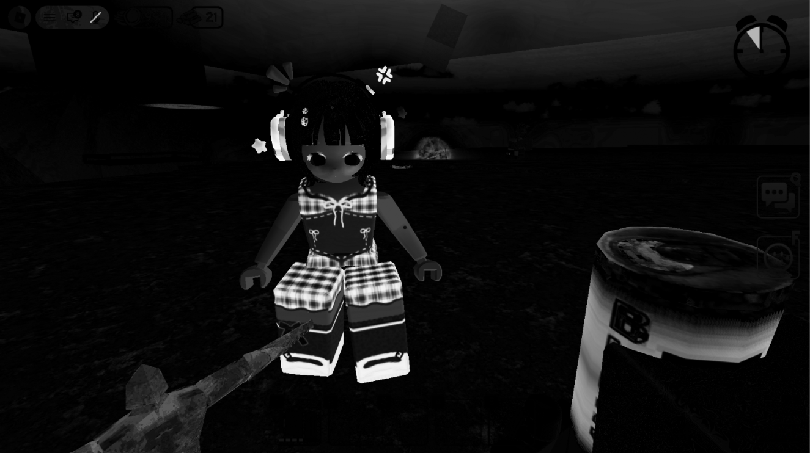

Gambar ini menunjukkan channel **Magenta (M)**.

Rumus yang digunakan:

$$
M=1-G
$$

Nilai Magenta diperoleh dari kebalikan channel Green yang telah dinormalisasi.

---

## 4.4 CMYK - Yellow

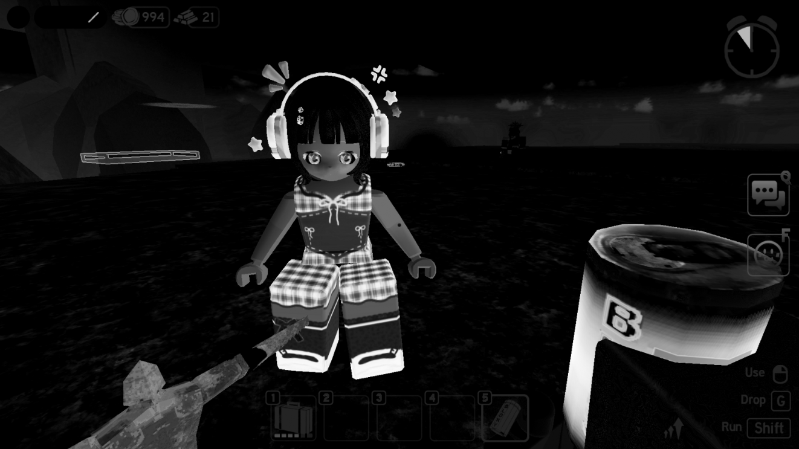

Gambar ini menunjukkan channel **Yellow (Y)**.

Rumus yang digunakan:

$$
Y=1-B
$$

Nilai Yellow diperoleh dari kebalikan channel Blue.

---

## 4.5 CMYK - Black

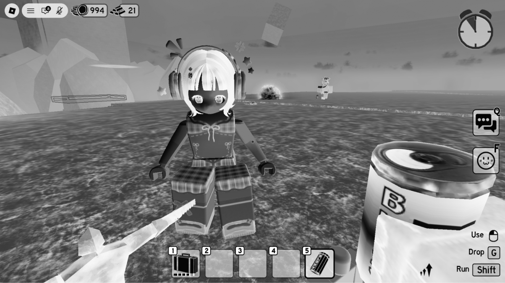

Gambar ini menunjukkan channel **Black (K)**.

Nilai K diperoleh menggunakan:

$$
K=\min(C,M,Y)
$$

Artinya, untuk setiap piksel program mencari nilai terkecil dari Cyan, Magenta, dan Yellow.

Nilai tersebut digunakan sebagai komponen Black pada model CMYK.

---

# 5. Konversi RGB ke HSI

**HSI** merupakan model warna yang terdiri dari:

* Hue (H)
* Saturation (S)
* Intensity (I)

HSI memisahkan informasi warna dengan tingkat intensitas atau kecerahan.

Hal tersebut membuat model HSI berbeda dengan RGB karena warna dan tingkat kecerahan direpresentasikan secara terpisah.

---

## 5.1 Intensity

Intensity menunjukkan nilai rata-rata dari ketiga channel RGB.

Rumusnya:

$$
I=\frac{R+G+B}{3}
$$

Sebagai contoh, jika:

```text
R = 100
G = 150
B = 200
```

maka:

$$
I=\frac{100+150+200}{3}
$$

$$
I=150
$$

Jadi nilai Intensity piksel tersebut adalah `150`.

---

## 5.2 Saturation

Saturation menunjukkan tingkat kemurnian atau kejenuhan warna.

Pertama dicari nilai minimum dari ketiga channel:

$$
min(R,G,B)
$$

Kemudian digunakan rumus:

$$
S=
1-
\frac{3\min(R,G,B)}
{R+G+B}
$$

Jika nilai RGB memiliki perbedaan yang besar, saturation cenderung lebih tinggi.

Sebaliknya, ketika nilai RGB hampir sama, saturation akan mendekati nol.

Pada gambar grayscale:

```text
R = G = B
```

nilai saturation menjadi:

```text
S = 0
```

---

## 5.3 Hue

Hue menunjukkan jenis atau posisi warna pada lingkaran warna.

Perhitungan Hue menggunakan rumus:

$$
\theta=
\cos^{-1}
\left(
\frac{
\frac{1}{2}[(R-G)+(R-B)]
}{
\sqrt{
(R-G)^2+(R-B)(G-B)
}
}
\right)
$$

Hasil arccos diperoleh dalam radian kemudian dikonversi menjadi derajat.

Konversi dilakukan menggunakan:

```python
theta = np.degrees(theta)
```

Kemudian nilai Hue ditentukan berdasarkan hubungan antara G dan B.

Jika:

$$
G\geq B
$$

maka:

$$
H=\theta
$$

Sedangkan jika:

$$
G<B
$$

maka:

$$
H=360-\theta
$$

Perbedaan tersebut diperlukan agar posisi Hue berada pada rentang:

```text
0° - 360°
```

Untuk piksel grayscale, ketika:

$$
R=G=B
$$

Hue ditetapkan menjadi:

```text
0°
```

---

# 6. Hasil Konversi HSI

## 6.1 Hue

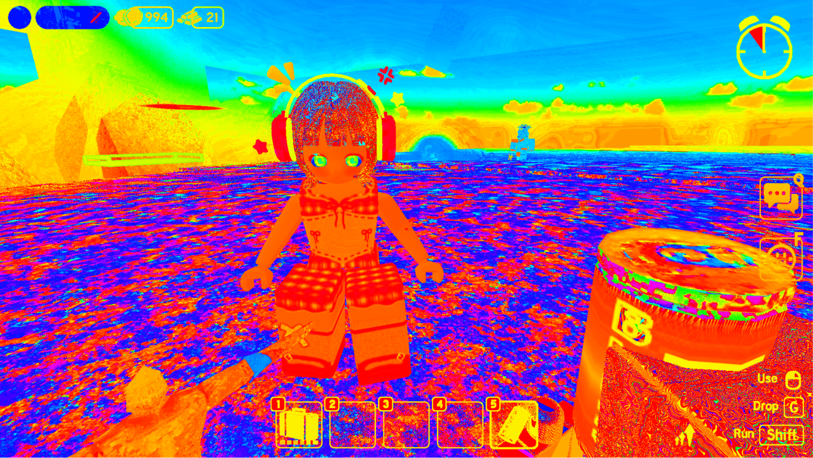

Gambar ini menunjukkan channel **Hue** dari model HSI.

Hue menunjukkan jenis warna berdasarkan posisi pada lingkaran warna dengan rentang:

```text
0° - 360°
```

Nilai Hue dihitung menggunakan hubungan matematis antara channel R, G, dan B.

Visualisasi menggunakan colormap `hsv` sehingga perbedaan nilai Hue dapat terlihat sebagai perbedaan warna.

---

## 6.2 Saturation

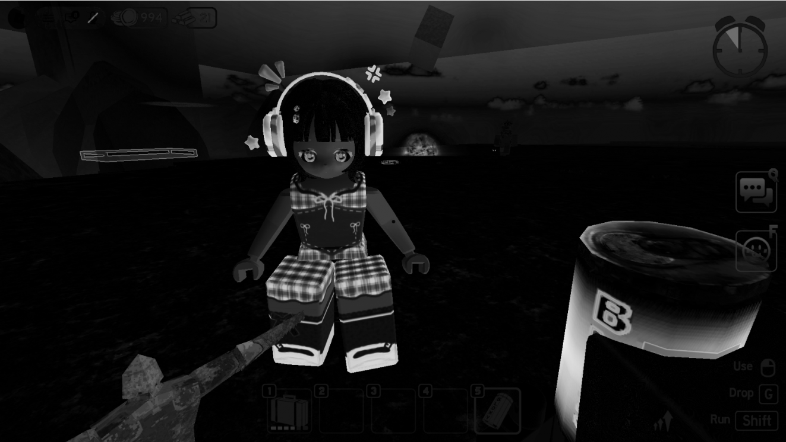

Gambar ini menunjukkan channel **Saturation** dari model HSI.

Nilai saturation menunjukkan tingkat kejenuhan warna.

Nilai saturation kemudian ditampilkan dalam grayscale.

Bagian dengan saturation lebih tinggi akan memiliki intensitas yang lebih tinggi, sedangkan warna yang mendekati grayscale memiliki nilai saturation yang lebih rendah.

---

## 6.3 Intensity

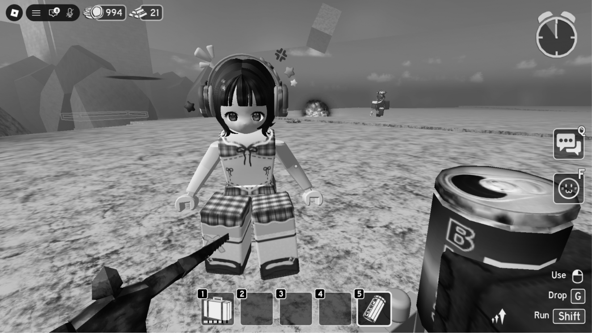

Gambar ini menunjukkan channel **Intensity** dari model HSI.

Intensity dihitung menggunakan:

$$
I=\frac{R+G+B}{3}
$$

Nilai tersebut menunjukkan tingkat intensitas atau kecerahan rata-rata dari ketiga channel RGB.

---

# 7. Konversi RGB ke HSV

**HSV** merupakan model warna yang terdiri dari:

* Hue (H)
* Saturation (S)
* Value (V)

HSV sering digunakan untuk merepresentasikan warna berdasarkan jenis warna, tingkat kejenuhan, dan tingkat kecerahan.

Sebelum menghitung HSV, nilai RGB dinormalisasi menjadi:

```text
0 - 1
```

Kemudian dicari:

$$
MAX=\max(R,G,B)
$$

dan:

$$
MIN=\min(R,G,B)
$$

Selanjutnya dihitung:

$$
\Delta=MAX-MIN
$$

---

## 7.1 Value

Value menunjukkan nilai maksimum dari channel RGB.

Rumus:

$$
V=\max(R,G,B)
$$

Jika salah satu channel memiliki nilai paling tinggi, maka nilai tersebut menjadi Value.

---

## 7.2 Saturation

Saturation pada HSV dihitung menggunakan:

$$
S=\frac{\Delta}{MAX}
$$

Jika:

$$
MAX=0
$$

maka saturation ditetapkan menjadi:

```text
0
```

Hal tersebut dilakukan untuk menghindari pembagian dengan nol.

---

## 7.3 Hue

Perhitungan Hue pada HSV bergantung pada channel yang memiliki nilai maksimum.

Jika:

$$
R=MAX
$$

maka:

$$
H=
60
\left(
\frac{G-B}{\Delta}
\right)
$$

Jika:

$$
G=MAX
$$

maka:

$$
H=
60
\left(
\frac{B-R}{\Delta}+2
\right)
$$

Jika:

$$
B=MAX
$$

maka:

$$
H=
60
\left(
\frac{R-G}{\Delta}+4
\right)
$$

Jika hasil Hue negatif, maka ditambahkan:

$$
360^\circ
$$

sehingga nilai Hue berada pada rentang:

```text
0° - 360°
```

Jika:

$$
\Delta=0
$$

maka tidak terdapat perbedaan antara nilai maksimum dan minimum, sehingga Hue ditetapkan menjadi:

```text
0°
```

---

# 8. Hasil Konversi HSV

## 8.1 Hue

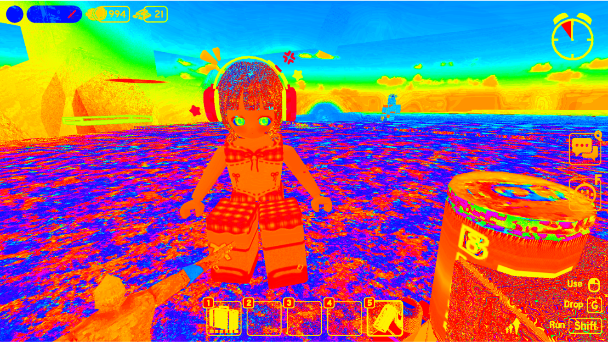

Gambar ini menunjukkan channel **Hue** dari model HSV.

Hue menunjukkan jenis warna berdasarkan posisi warna pada lingkaran warna.

Nilai Hue berada pada rentang:

```text
0° - 360°
```

Visualisasi menggunakan colormap `hsv`.

---

## 8.2 Saturation

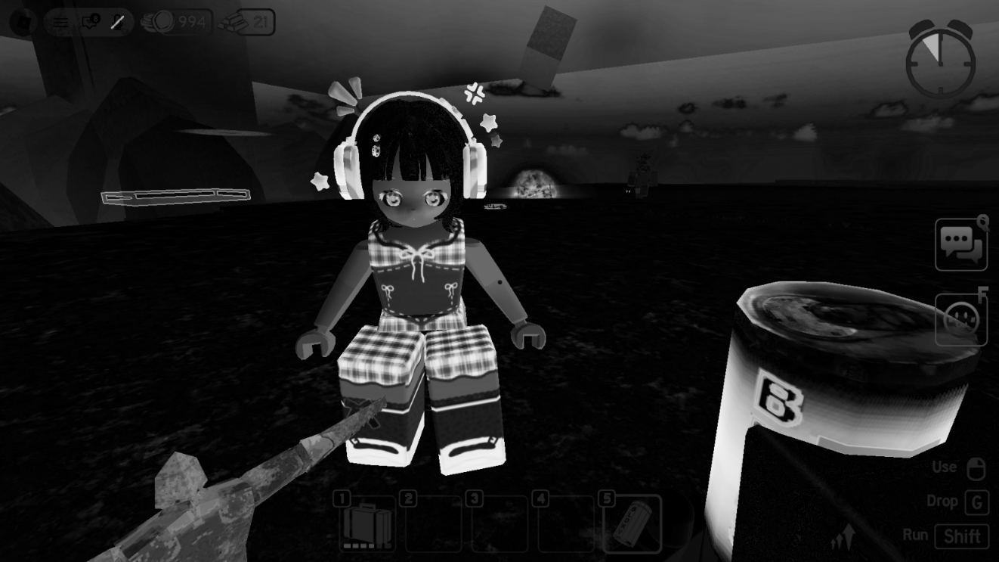

Gambar ini menunjukkan channel **Saturation** dari model HSV.

Saturation menunjukkan tingkat kejenuhan warna.

Nilai saturation dihitung menggunakan:

$$
S=\frac{\Delta}{MAX}
$$

Nilai yang lebih tinggi menunjukkan warna yang lebih jenuh, sedangkan nilai yang mendekati nol menunjukkan warna yang lebih mendekati grayscale.

---

## 8.3 Value

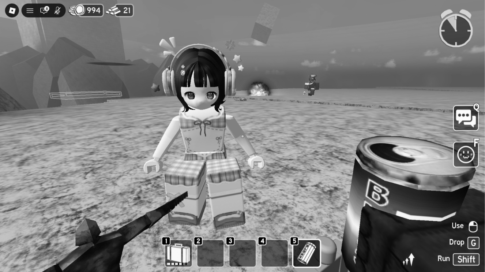

Gambar ini menunjukkan channel **Value** dari model HSV.

Value dihitung menggunakan:

$$
V=\max(R,G,B)
$$

Nilai Value menunjukkan tingkat kecerahan berdasarkan channel RGB yang memiliki nilai paling tinggi.

---

# 9. Contoh Konversi Satu Piksel

Program juga mengambil **piksel yang berada di tengah gambar** untuk menunjukkan contoh hasil konversi.

Posisi piksel ditentukan menggunakan:

```python
center_y = height // 2
center_x = width // 2
```

Kemudian nilai RGB piksel tersebut diambil:

```python
rgb_pixel = image_rgb[
    center_y,
    center_x
]
```

Nilai tersebut kemudian dipisahkan menjadi:

```text
R
G
B
```

Program menampilkan hasil konversi piksel tersebut ke dalam:

```text
RGB
CMYK
HSI
HSV
```

Untuk CMYK, hasil ditampilkan dalam bentuk persentase.

Untuk HSI dan HSV, Hue ditampilkan dalam derajat.

Dengan demikian, program tidak hanya menghasilkan visualisasi seluruh gambar, tetapi juga menunjukkan contoh nilai numerik dari satu piksel.

---

# 10. Perbedaan Model Warna

Secara umum, masing-masing model warna memiliki karakteristik yang berbeda.

| Model Warna | Komponen                     | Fungsi Utama                                                      |
| ----------- | ---------------------------- | ----------------------------------------------------------------- |
| RGB         | Red, Green, Blue             | Representasi warna berbasis cahaya                                |
| CMYK        | Cyan, Magenta, Yellow, Black | Representasi warna berbasis tinta                                 |
| HSI         | Hue, Saturation, Intensity   | Memisahkan warna dan intensitas                                   |
| HSV         | Hue, Saturation, Value       | Merepresentasikan warna berdasarkan Hue, kejenuhan, dan kecerahan |

### RGB

```text
R + G + B
```

RGB menggunakan tiga channel warna dasar untuk membentuk berbagai warna.

### CMYK

```text
C + M + Y + K
```

CMYK menggunakan Cyan, Magenta, Yellow, dan Black dan lebih sesuai untuk sistem pencetakan.

### HSI

```text
H + S + I
```

HSI memisahkan jenis warna, tingkat kejenuhan, dan intensitas.

### HSV

```text
H + S + V
```

HSV memisahkan jenis warna, tingkat kejenuhan, dan nilai kecerahan.

---

# 11. Urutan Hasil Program

Urutan gambar hasil yang digunakan dalam tugas ini adalah:

```text
1.png  → RGB
2.png  → CMYK - Cyan
3.png  → CMYK - Magenta
4.png  → CMYK - Yellow
5.png  → CMYK - Black
6.png  → HSI - Hue
7.png  → HSI - Saturation
8.png  → HSI - Intensity
9.png  → HSV - Hue
10.png → HSV - Saturation
11.png → HSV - Value
```

Struktur folder gambar:

```text
image/
├── 1.png
├── 2.png
├── 3.png
├── 4.png
├── 5.png
├── 6.png
├── 7.png
├── 8.png
├── 9.png
├── 10.png
└── 11.png
```

---

# 12. Kesimpulan

Pada tugas ini dilakukan proses konversi model warna dari **RGB ke CMYK, HSI, dan HSV** secara manual menggunakan NumPy.

RGB digunakan sebagai model warna awal karena gambar yang digunakan memiliki tiga channel utama yaitu Red, Green, dan Blue.

Pada model CMYK, RGB dikonversi menjadi Cyan, Magenta, Yellow, dan Black menggunakan proses normalisasi dan perhitungan berdasarkan nilai minimum setiap channel.

Pada model HSI, warna dipisahkan menjadi Hue, Saturation, dan Intensity. Hue menunjukkan jenis warna, Saturation menunjukkan tingkat kejenuhan, sedangkan Intensity menunjukkan rata-rata nilai RGB.

Pada model HSV, warna dipisahkan menjadi Hue, Saturation, dan Value. Hue menunjukkan jenis warna, Saturation menunjukkan tingkat kejenuhan, sedangkan Value menunjukkan nilai maksimum dari channel RGB.

Dari proses tersebut dapat diketahui bahwa satu gambar RGB dapat direpresentasikan dalam beberapa model warna yang berbeda. Setiap model memiliki cara representasi dan tujuan penggunaan yang berbeda, sehingga pemilihan model warna dapat disesuaikan dengan kebutuhan pengolahan citra.
